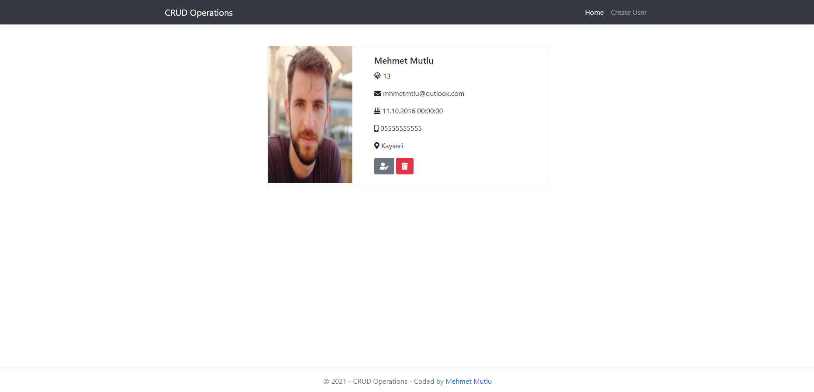

# 🖥️ .Net Core CRUD Operations

I have coded a web application which can be used to make CRUD operations with .Net Core. I have used tools which are presented in below.

# 🧰 Toolbox

<ul style="list-style-type:disc">
   <li><a href="https://docs.microsoft.com/tr-tr/aspnet/core/introduction-to-aspnet-core?view=aspnetcore-5.0">.Net Core</a></li>
   <li><a href="https://docs.microsoft.com/tr-tr/aspnet/core/mvc/overview?view=aspnetcore-5.0">.Net Core MVC</a></li>
   <li><a href="https://www.postgresql.org">PostgreSQL</a></li>
   <li><a href="https://docs.microsoft.com/tr-tr/ef/core/">Entity Framework Core</a></li>
   <li><a href="https://www.npgsql.org/efcore/">Npgsql Entity Framework Core Provider</a></li>
   <li><a href="https://getbootstrap.com">Bootstrap</a></li>
</ul>

# 🎞️ Screenshots

